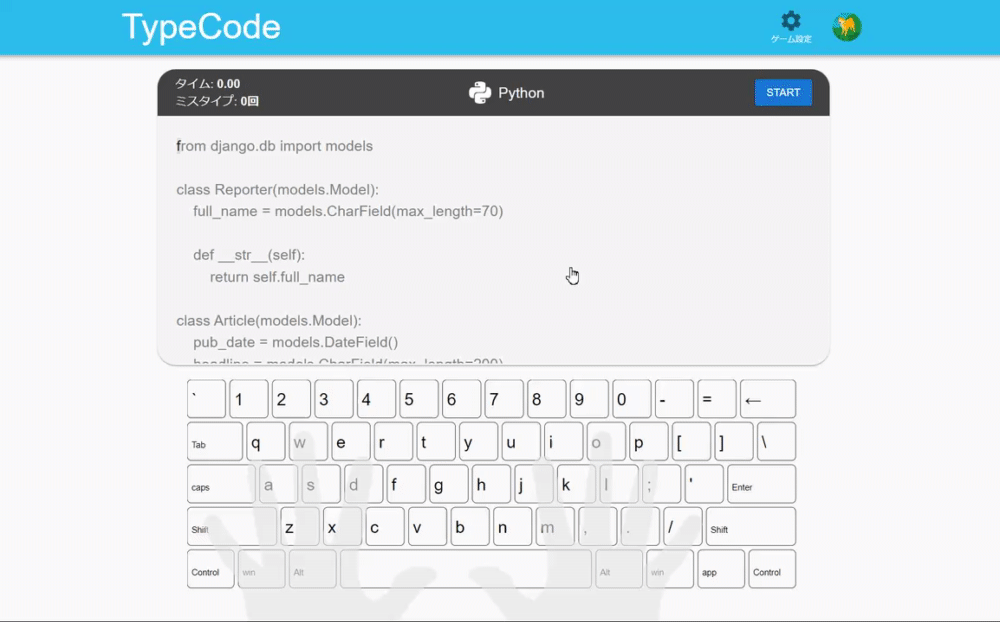
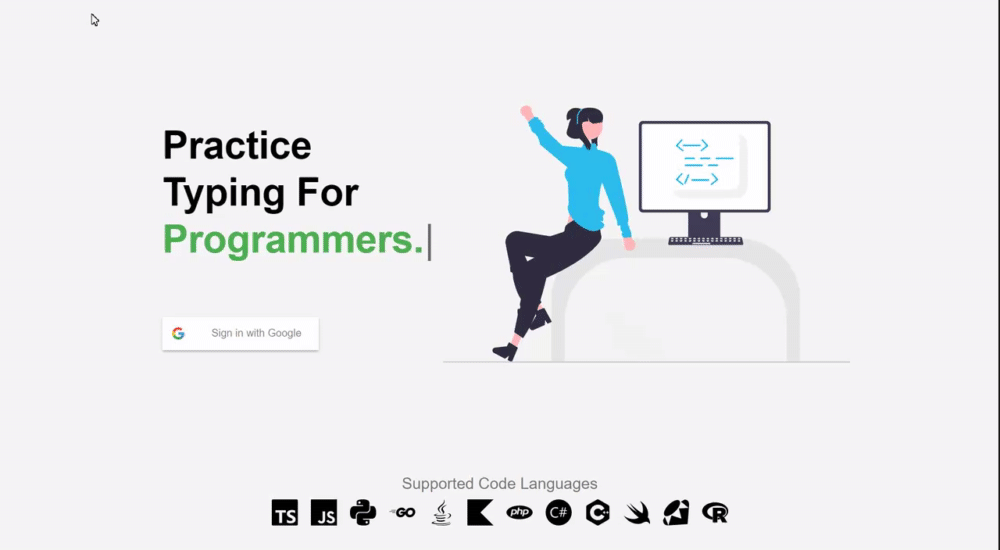
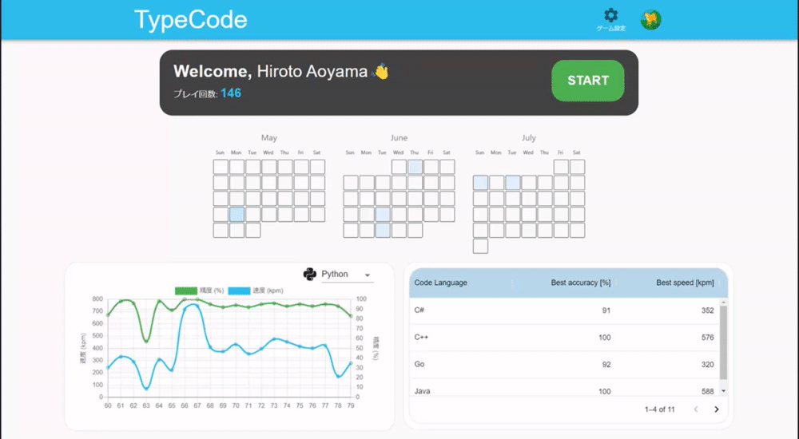
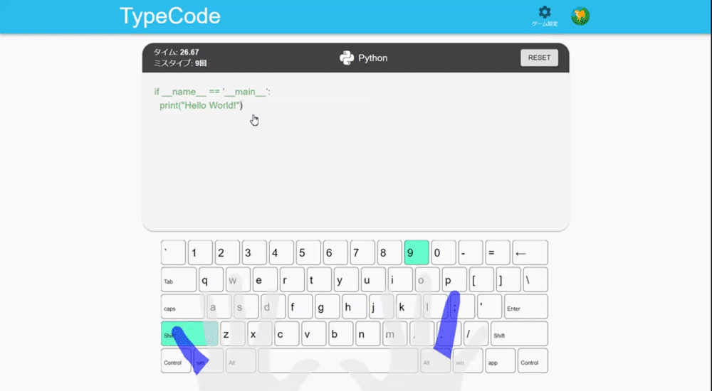

<h1 align="center">
  TypeCode
  <br>
</h1>

<h3 align="center">A typing game made for programmers, <br /> built with Typescript, React and Firebase.</h3>
<p align="center">https://recursion-typecode.netlify.app/</p>
<br />

<div align="center">
    
</div>

## About

TypeCode was made with the aim to improve typing accuracy and speed for programmers. <br />
By typing code snippets taken from LeetCode and framework documentations for various code languages, 
the player can work to improve on their ability to type special characters for programming (such as ```\```, ```|```, ```{}```, etc.) as well as familiarizing themselves with specific code language syntax. Additionally, code snippets can be imported by the user from a github repository if the player wishes to practice specific code. <br /><br />
By playing the game, user records for accuracy, speed and finger specfic statistics are stored for each code language, which can then be reviewed by the player later on to motivate and track improvement. <br />

## Technologies
Project created with:
- React v17
- Material UI v5
- Typescript
- Firebase v9
- Framer Motion v6
- chart.js v2
- Netlify

Additionally, Husky and Lint-Staged were used to maintain branches and to improve overall git workflow.

## Features

- Fully animated landing page using <a href="https://www.framer.com/motion/" target="_blank">Framer Motion</a>
  - Google login was implemented using <a href="https://firebase.google.com/docs/auth?hl=ja" target="_blank">Firebase Auth</a>
<p align="center">
  
</p>

- Dashboard that displays user specific statistics on past games played.
  - User data is stored via <a href="https://firebase.google.com/docs/firestore/data-model?hl=ja" target="_blank">Firestore</a>, where ```onSnapShot()``` was used to display realtime changes in data.
<p align="center">
  
</p>

- Results page that display statistics on the previous game played.
<p align="center">
  
</p>

## Available Scripts

In the project directory, you can run:

### `npm start`

Runs the app in the development mode.\
Open [http://localhost:3000](http://localhost:3000) to view it in the browser.

The page will reload if you make edits.\
You will also see any lint errors in the console.

### `npm test`

Launches the test runner in the interactive watch mode.\
See the section about [running tests](https://facebook.github.io/create-react-app/docs/running-tests) for more information.

### `npm run build`

Builds the app for production to the `build` folder.\
It correctly bundles React in production mode and optimizes the build for the best performance.

The build is minified and the filenames include the hashes.\
Your app is ready to be deployed!

See the section about [deployment](https://facebook.github.io/create-react-app/docs/deployment) for more information.

### `npm run eject`

**Note: this is a one-way operation. Once you `eject`, you can’t go back!**

If you aren’t satisfied with the build tool and configuration choices, you can `eject` at any time. This command will remove the single build dependency from your project.

Instead, it will copy all the configuration files and the transitive dependencies (webpack, Babel, ESLint, etc) right into your project so you have full control over them. All of the commands except `eject` will still work, but they will point to the copied scripts so you can tweak them. At this point you’re on your own.

You don’t have to ever use `eject`. The curated feature set is suitable for small and middle deployments, and you shouldn’t feel obligated to use this feature. However we understand that this tool wouldn’t be useful if you couldn’t customize it when you are ready for it.
